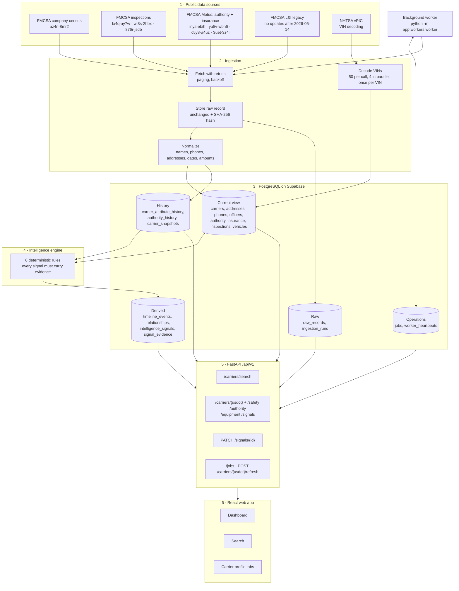
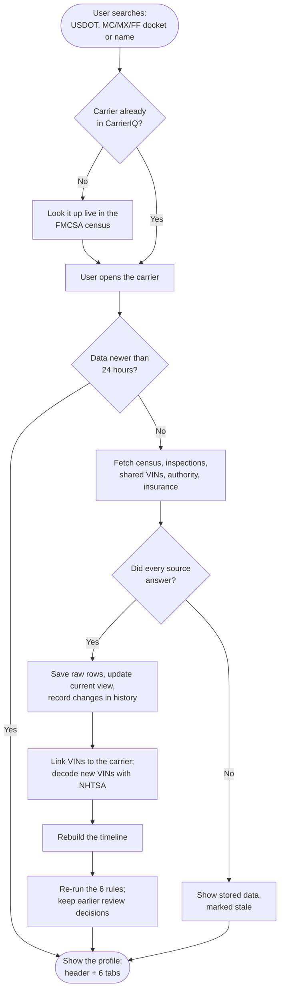
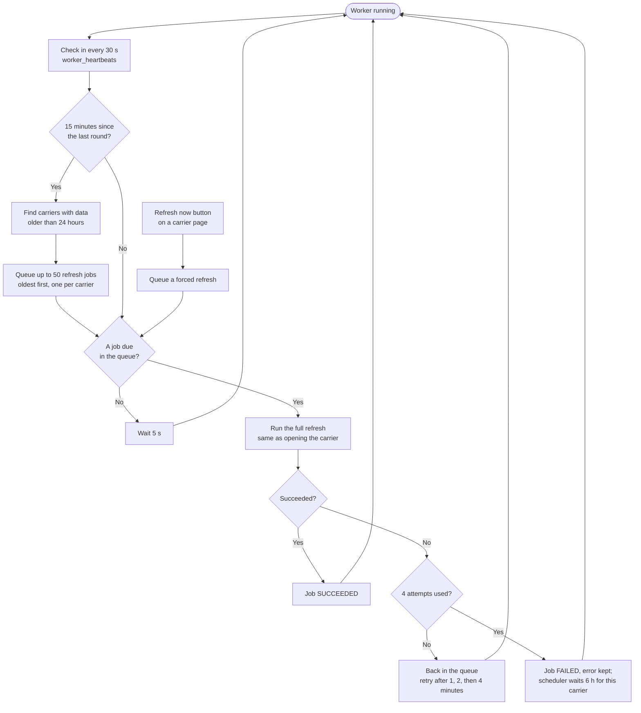
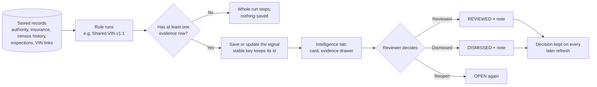
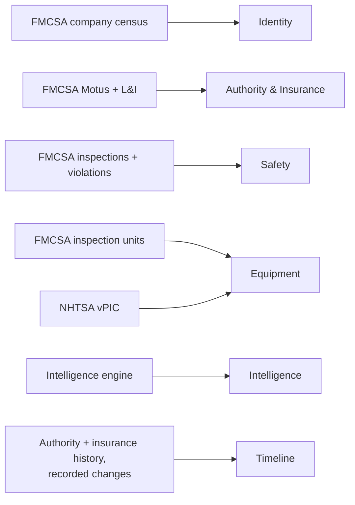

# CarrierIQ architecture

CarrierIQ pulls a motor carrier's public federal records, keeps every version it sees, and turns
changes and patterns into review signals. Each signal shows the exact records behind it.

The diagrams below are Mermaid flowcharts. They render on GitHub and in VS Code, with the
"Markdown Preview Mermaid Support" extension.

---

## 1. System overview

How data flows from the public sources to the screens office staff use.

---

## 2. Looking up a carrier

What happens when someone searches for a carrier and opens its profile.

---

## 3. Background worker

Keeps loaded carriers fresh without anyone opening them. The job queue is a table in the same
database, so no extra service such as Redis is needed.

---

## 4. How a signal is made and reviewed

### The six rules

| Rule | Looks for | Typical severity |
|---|---|---|
| Authority change | Revoked, suspended, reinstated or pending-revocation authority in the last 2 years | High for revoked or suspended |
| Insurance change | New insurer, coverage change, cancellation, coverage gap, required insurance not on file | Info for a new insurer; Medium for a gap |
| Identity change | Changed legal name, DBA, email, address, phone, officers or web domain | Medium for a legal name |
| Fleet consistency | Registered trucks vs. trucks seen on inspections in 24 months | Low |
| Safety trend | Out-of-service rate in the last 12 months vs. the 12 before | Low; Medium for a rise of 20+ points |
| Shared VIN | The same vehicle inspected under another USDOT number | Low; Medium for 3+ vehicles |

Signals use careful wording such as "requires review" or "potential relationship". They prompt a
review; they are not findings.

---

## 5. Carrier profile tabs and their sources

| Tab | What it shows |
|---|---|
| Identity | Legal and DBA name, entity type, drivers, MCS-150 date, officers, phones, addresses |
| Authority & Insurance | MC/MX/FF dockets and status, required vs. filed insurance, policies on file, insurance and authority history |
| Safety | Inspection counts, vehicle and driver out-of-service rates, quarterly trends, violations, inspection list |
| Equipment | Every VIN seen with year, make and model; trucks vs. trailers; registered vs. seen fleet; vehicles also seen under other carriers |
| Intelligence | Signals grouped by type, the evidence behind each, review actions, carriers linked through shared equipment |
| Timeline | Authority and insurance events and recorded changes, newest first, with links to related signals |

---

## 6. Technology

| Layer | Technology |
|---|---|
| Web app | React 19, TypeScript, Vite, Tailwind CSS, TanStack Query, React Router |
| API | Python, FastAPI, Pydantic |
| Data access | SQLAlchemy 2, Alembic migrations, psycopg 3 |
| Database | PostgreSQL on Supabase |
| Background work | Python worker with a PostgreSQL job queue; see [queue-evaluation.md](queue-evaluation.md) |
| Running locally | Docker Compose: backend, worker, frontend, optional local database |

A visual version of this page is in [architecture.html](architecture.html).
